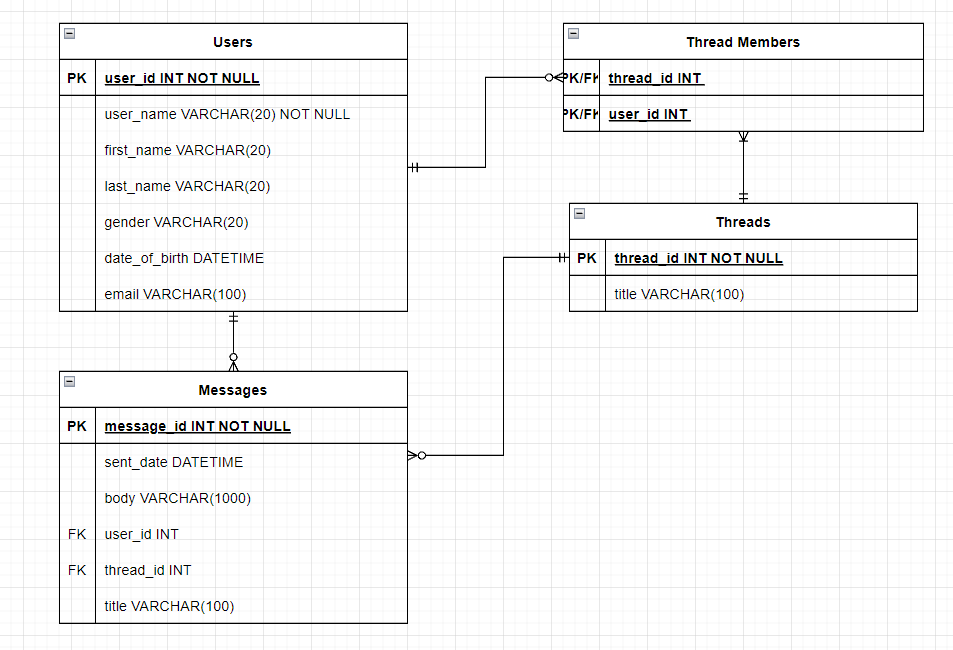

# PG209 Backend programmering eksamen
### Azure Link: https://chat-room-47940.azurewebsites.net/

## Sjekkliste for innleveringen

* [x] Dere har lest eksamensteksten
* [x] Koden er sjekket inn på github.com/pg209-2022 repository
* [ ] Dere har lastet opp en ZIP-fil lastet ned fra Github
* [x] Dere har committed kode med begge prosjektdeltagernes GitHub-konto (alternativt: README beskriver hvordan dere har jobbet)

## README.md

* [x] Inneholder link til Azure Websites deployment
* [x] Inneholder en korrekt badge til GitHub Actions
* [x] Beskriver hva dere har løst utover minimum
* [x] Inneholder et diagram over databasemodellen

## Koden

* [x] Oppfyller Java kodestandard med hensyn til indentering og navngiving
* [x] Er deployet korrekt til Azure Websites
* [x] Inneholder tester av HTTP og database-logikk
* [x] Bruker Flyway DB for å sette opp databasen
* [x] Skriver ut nyttige logmeldinger

## Basisfunksjonalitet

* [x] Kan velge hvilken bruker vi skal opptre som
* [x] Viser eksisterende meldinger til brukeren
* [x] Lar brukeren opprette en ny melding
* [x] Lar brukeren svare på meldinger
* [x] For A: Kan endre navn og annen informasjon om bruker
* [x] For A: Meldingslisten viser navnet på avsender og mottakere

## Kvalitet

* [x] Datamodellen er *normalisert* - dvs at for eksempel navnet på en meldingsavsender ligger i brukertallen, ikke i meldingstabellen
* [x] Når man henter informasjon fra flere tabellen brukes join, i stedet for 1-plus-N queries (et for hovedlisten og et per svar for tilleggsinformasjon)
* [x] Det finnes test for alle JAX-RS endpoints og alle DAO-er

## ArbeidsForm
Vi jobbet stort sett eksklusivt med parprogrammering.
Der vi begge jobbet på en PC når vi jobbet var samlet fysisk,
men når det ikke var mulig så delte vi skjerm over Discord.
Det var en som gjorde meste parten av skrivingen(driver) mens andre holdt overblikket(navigator).
Det var noen ganger vi jobbet på to forskjellige ting men fortsatt sammen enten fysisk eller over Discord

## Funksjonelle Krav
Det er ikke mulig å refreshe reacten. Om du refesher så loader den bare. problemet er med reacten og om du går tilbake til frontpagen så virker det igjen.
Reacten viser kanskje mer data en "nødvendig" men det er for å se at dataen kommer fram.
Vi har krysset av hvilken punkter vi har fullført. 
vi har også muligheten til å lage nye brukere.
vi har også lagt til timestamp meldingene på når de ble sendt.
vi har også lagt til muligheten å legge til flere medlemmer i en tråden når den blir opprettet og i etterkant
###
1.
   * [x] Når man kommer til applikasjonen kan man velge hvilken bruker man skal representere fra et sett med brukere som derehar opprettet på forhånd i databasen
      * [x] For full uttelling skal man kunne endre informasjon om en eksisterende bruker
      * [x] For full uttelling må brukeren ha felter utover navn og emailadresse
2.
   * [x] Når man har valgt en bruker skal man kunne se alle meldingstråder der denne brukeren er sender eller mottaker (krav til E)
     * [x] For full uttelling skal oversikten over meldingertråder inneholde navnet på alle mottakere for meldinger itråden
     * [x] For full uttelling bør dere forhåndspopulere med noen meldingstråder
3.
   * [x] Når man har valgt en bruker kan man opprette en ny meldingstråd med mottaker. Meldingen skal kunne inneholde tittelog meldingstekst (krav til E)
     * [x] For full uttelling må det være mulig å opprette en meldingstråd til med flere mottakere
     * [x] For full uttelling må det meldingen inneholde flere felter enn tittel og meldingstekst
4.
   * [x] Når en bruker velger en meldingstråd skal de se alle meldinger i tråden
     * [x] For full uttelling må backend gjøre en join mellom melding- og brukertabellen for å vise avsenders navn
5.
   * [x] Når en bruker velger en meldingstråd skal det være mulig å svare på meldingstråden
     * [x] For full uttelling må svaret inneholde flere felter enn meldingstekst
     * [ ] For ekstra poeng: Registrer når en bruker har lest en melding og vis dette tidspunktet til andre brukere som kan semeldingen

   
## Database

## Plan
---- Konvertering og grunnmur på plass ----
* [x] Klone kode fra arbeidskrav som startingPoint
* [x] Modifisere koden slik at den bruker User
* [x] Lage startingPoint for DB i flyway migration fil
  * [ ] (EXTRA) lage test for å teste @manytoone relasjoner mellom Message og User
* [x] Lage UserEndPoint 
 * [x] lage tester for UserEndPoint.
  * [x] trenger vi mer en GET test? Ja, vi gjorde det 
 * [x] lage ny UserEndPoint klasse 
 * [x] Lage @GET og POST
 * [x] @Inject userDao 
  * [x] Kan vi bruke samme config på flere endPoints? Binde flere classer etter hverandre i ChatRoomConfig? Ja, det kunne vi! (*￣3￣)╭
* [ ] (EXTRA) abstrakt dao test ??
* [x] Slette alle referanser til Item i koden.
* [x] Endre ServeFrontPage test og react til å passe nytt prosject. (BASIC).
* [x] lage DAO og test for Message
* [x] lage DAO og test for Thread 
* [x] lage DAO og test for ThreadMembers

---- Business Logic ----

* [x] Lage Abstrakt DAO test
* [x] Extra :
  * Email på bruker
  * Tittel på melding i tråd 
  * vise tråd tittel på tråd